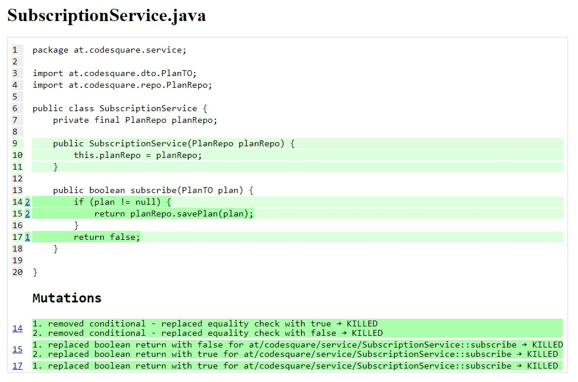

# Mutation Testing - Pitest
Java mutation testing using [Pitest](https://pitest.org/)

## Test
Following command will output a html report to `target/pit-reports/index.html`
```
mvn test-compile org.pitest:pitest-maven:mutationCoverage
```
index.html


